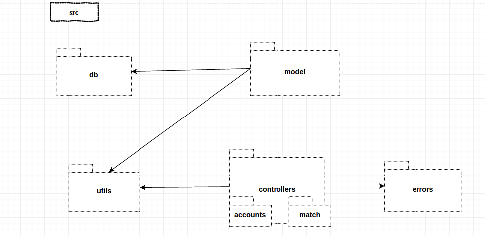
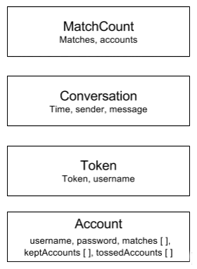

*********
MatchApp

Manual de programador - Documentacion Tecnica
*********
**Grupo 10**

**Ayudante asignado: Christian Calonico**

**Integrantes:**

+-------------------------------------+--------------------------------------+
|       Apellido y Nombre             |              Padrón                  |
+=====================================+======================================+
|       Daye, Gisela Denise           |              87602                   |
+-------------------------------------+--------------------------------------+
|       Federico, Pablo               |              90280                   |
+-------------------------------------+--------------------------------------+
|       Farina, Federico              |              90177                   |
+-------------------------------------+--------------------------------------+
|       Vazquez, Nicolás              |              89172                   |
+-------------------------------------+--------------------------------------+

============================================
Tecnologias utilizadas
============================================

Cliente
----------------------------------------

- Android SDK compatible hasta v23
- Volley
- Material Design para templates

Application Server
----------------------------------------
- Cmake
- CI-Travis
- Mongoose-cpp
- jsoncpp
- casablanca
- RocksDB (librocksdb.so.4.4.1)
- Docker
- Code coverage con gcov
- Unit tests (cppunit)
- Tests de endpoints con postman 
- Tests functionales con python, pip y la libreria requests

Shared Server
----------------------------------------
- Utilización de Heroku, para hostear nuestra base de datos y la aplicación web.
.. image:: Screenshots/heroku.png

- Utilización de Express + Node.js en sus versiones 4.13 y 0.12.7 respectivamente.

- Utilización de una base de datos PostgreSQL para almacenamiento de la información de Match App.
.. image:: Screenshots/postgresql.png

- Aplicación Web utilizando CSS, HTML, Boostrap + Materialize, JQuery y Ajax.
- Test  de endpoints con Postman
- Docker

Proyecto
----------------------------------------
-- Documentacion en Sphinx
- Repositorios git. Utilización de 3 repositorios en GitHub, uno para el cliente, otro para el App Server y otro para el Shared Server.
- Shared Server: https://github.com/PabloFederico/SharedServer
- App Server: https://github.com/nicolas-vazquez/tp75521c
- Cliente y Documentación: https://github.com/gisedaye/taller2android

============================================
Arquitectura
============================================

.. image:: Screenshots/architecture.png

Appserver
--------------------------------------------

Esquemas
""""""""""""""""""
Paquetes del appServer

Modelos y Controladores basicos del sistema.

.. image:: Screenshots/classesapp.png

Tablas de rocksDB con el contenido de sus registros.

Diagrama de secuencia

..image:: Screenshots/secuenciaAppMain.png

Endpoints
""""""""""""""""""
A continuacion se dara una breve descripcion de los distintos endpoints del appserver y como se manejan para obtener la informacion.

Signup
"""""""""

- Desde el cliente request a AppServer con los datos del profile y intereses completos.
- Request a SharedServer para crear un usuario con los datos restantes (profile y intereses).
- Guardo la información del profile en SharedServer.
- El AppServer guarda username y password.
- Vuelvo con un Successful SignUp all cliente.

Login
"""""""""

- Desde el cliente request a AppServer con username/password
- Busco el usuario en el AppServer:
- En el caso que exista devuelvo accessToken
- Si no existe hago un request a SharedServer, puede ser que el usuario haya sido creado desde el backoffice.
- Busco el usuario en el SharedServer y devuelvo username/password
- Guardo username/password y accesstoken/username en el AppServer
- Vuelvo al cliente con el access token

Like/Dislike
"""""""""

- Desde el cliente request a AppServer con el id
- Guardamos el id en el array de keptAccounts
- Si hay un match lo guardamos

GetCandidates
"""""""""

- Desde el cliente request a AppServer  GET /candidates con location.
- Busco el usuario en el AppServer, obtengo el username
- Request a SharedServer con username
- SharedServer determina los candidatos de acuerdo a los intereses del usuario 
- Devuelvo los candidatos al AppServer y filtro por likes/dislikes
- Devuelvo los candidatos filtrados al cliente

GetMatches
"""""""""

- Desde el cliente request al AppServer GET /matches
- Obtenemos la lista de matches
- Request a SharedServer con la lista
- Obtenemos los perfiles asociados
- Devuelvo los matches al cliente

Sharedserver
--------------------------------------------

Esquemas
""""""""""""""""""

- A continuación se mostrara un esquema de funcionamiento del Shared Sever, para poder explicar el flujo en la utilización de la api
.. image:: Screenshots/esquemaShared.png

- En el siguiente Diagrama de Componentes podemos visualizar la interacción entre los diferentes modulos de Shared Server. Por un lado, todas las librerias necesarias para el funcionamiento dentro de node_modules, como estas son solicitadas por las vistas de la aplicación. La parte central del codigo comandado por el motor donde se encuentra el archivo inicial app.js y la intracción que éstos tienen con los otros componentes, como por ejemplo el node_module

.. image:: Screenshots/componentes3Shared.png 

- Se crearon tres tablas en la base de datos de PostgreSQL para almacenar la información de los usuarios y sus intereses. EL esquema de tablas utilizados es el siguiente
.. image:: Screenshots/tablasShared.png

- El siguiente es un Diagrama Entidad-Relación utilizado:

.. image:: Screenshots/derShared.png

Listado de usuarios
""""""""""""""""""
- Request GET /users/
- Busca a todos los usuarios del sharedserver
- Devuelve array de usuarios con: id, name, alias, email, sex, age, photo_profile, array de interests, location, metadata

Alta de usuario
""""""""""""""""""
- Request POST /users/ con parametros: name, alias, email, sex, age, interests, location 
- Crea al usuario  en el sharedserver

Consulta perfil de usuario
""""""""""""""""""
- Request GET /users/+id
- Busca en el shared server usuario con ese id
- Devuelve un objeto user con: id, name, alias, email, sex, age, photo_profile, array de interests, location, metadata

Edicion de usuario
""""""""""""""""""
- Request PUT /users/+id con parametros: id, name, alias, email, sex, age, photo_profile, interests, location 
- Modifica al usuario  en el sharedserver

Actualización foto perfil
""""""""""""""""""
- Request PUT /users/+id/photo con parametro: photo en base64
- Agrega una foto de perfil al usuario con id +id.

Baja de usuario
""""""""""""""""""
- Request DELETE /users/+id
- Elimina al usuario del sharedserver

Listado de intereses
""""""""""""""""""
- Request GET /interests/
- Busca a todos los intereses del sharedserver
- Devuelve array de intereses con: category, value

Alta de interes
""""""""""""""""""
- Request POST /interests/ con parametros: category, value
- Crea al interes en el sharedserver en esa categoria

Client
--------------------------------------------
- Consume los endpoints del appserver para Login, Registro, Candidatos, Matches, Like, Dislike, Message, Messages, Users, Interests
- Maneja session con el authorization token provisto por el endpoint del login
- Vistas:
	- LoginActivity	
	- RegisterActivity
	- MainActivity
	- SplashActivity

============================================
Testing
============================================

Appserver
--------------------------------------------

Correr Unit Tests
""""""""""""""""""

En la consola desde la carpeta build ejecutar el comando

 > ctest

Correr Coverage
""""""""""""""""""

En la raiz del proyecto correr

 > sudo ./coverage.sh

Se abrira una ventana del navegador con los resultados de tests cubiertos

.. image:: Screenshots/coverage.png

Correr Tests funcionales
""""""""""""""""""

Instalar python

> sudo apt-get install python2.7

Instalar pip

> wget https://bootstrap.pypa.io/get-pip.py
> sudo python get-pip.py

Instalar el modulo requests

> sudo pip install requests

Para correr los tests funcionales ir al directorio functionalTests y correr los tests

> cd functionalTests/
> python python restTester.py

Saldran los resultados del tests en la consola

Testear Endpoints Manualmente
""""""""""""""""""
Correr el appserver (Ver manual de instalacion)

SignUp
"""""""""

``POST http://127.0.0.1:8083/api/accounts/signup``

En la tab body, seleccionar el radiobutton raw y agregar el siguiente texto

``{
"username": "user",
"password": "P4ssw0rd"
}``

Login
"""""""""

``POST http://127.0.0.1:8083/api/accounts/login``

En la tab body, seleccionar el radiobutton raw y agregar el siguiente texto

``{
"username": "user",
"password": "P4ssw0rd"
}``

Matches
"""""""""

``GET http://127.0.0.1:8083/api/matches/``

Agregar el header con el token que recibio del endpoint de login

``Authorization: <token>``

Candidates
"""""""""

``GET http://127.0.0.1:8083/api/matches/candidates/``

Agregar el header con el token que recibio del endpoint de login

``Authorization: <token>``

Ver mensajes
"""""""""

``GET http://127.0.0.1:8083/api/matches/1/messages/``

Agregar el header con el token que recibio del endpoint de login

``Authorization: <token>``

Enviar mensaje
"""""""""

``PUT http://127.0.0.1:8083/api/matches/1/message/``

``{
"message": "Hola!"
}``

Agregar el header con el token que recibio del endpoint de login

``Authorization: <token>``

Like
"""""""""
``PUT http://127.0.0.1:8083/api/accounts/1/like/``

Agregar el header con el token que recibio del endpoint de login

``Authorization: <token>``

Disike
"""""""""

``PUT http://127.0.0.1:8083/api/accounts/3/dislike/``

Agregar el header con el token que recibio del endpoint de login

``Authorization: <token>``

Shared Server
--------------------------------------------

Testear manualmente
^^^^^^^^^^^^^^^^^^^^^^^^^^^^^^^^^^^^^^^^^^^^
Login
"""""""""

``POST http://127.0.0.1:8083/api/accounts/login``

En la tab body, seleccionar el radiobutton raw y agregar el siguiente texto

``{
"username": "user",
"password": "P4ssw0rd"
}``

Agregar headers

``Authorization: <token>``
``Content-Type: application/json``

Listado de  usuarios
"""""""""

``GET https://tallerdeprogramacionii-1c2016.herokuapp.com/users``

Vista de un usuario
"""""""""

``GET https://tallerdeprogramacionii-1c2016.herokuapp.com/users/5``

Vista de perfil de usuario
"""""""""

``GET https://tallerdeprogramacionii-1c2016.herokuapp.com/users/5/profile``

Agregar headers

``Authorization: <token>``
``Content-Type: application/json``

Vista de candidatos de usuario
"""""""""

``GET https://tallerdeprogramacionii-1c2016.herokuapp.com/users/nico/candidates``

Agregar headers

``Authorization: <token>``
``Content-Type: application/json``

Alta de usuario
"""""""""

``POST https://tallerdeprogramacionii-1c2016.herokuapp.com/users``

``{
"name":"Name",
"Alias":"aliiaass",
"email":"mail@mail.com", 
"latitude":"21222", 
"Longitude":"22322"
}``

Edit de usuario
"""""""""

``PUT https://tallerdeprogramacionii-1c2016.herokuapp.com/users/1``

``{
"id": 1,
"name":"Name",
"Alias":"aliiaass",
"email":"mail@mail.com", 
"latitude":"21222", 
"Longitude":"22322"
}``

Baja de usuario
"""""""""

``DELETE https://tallerdeprogramacionii-1c2016.herokuapp.com/users/20``

Listado de  intereses
"""""""""

``GET https://tallerdeprogramacionii-1c2016.herokuapp.com/interests``

Alta de interes
"""""""""

``POST https://tallerdeprogramacionii-1c2016.herokuapp.com/interests``

``{
"category":"Music",
"value":"One Direction"
}``

Baja de interes
"""""""""

``DELETE https://tallerdeprogramacionii-1c2016.herokuapp.com/interests/2``

