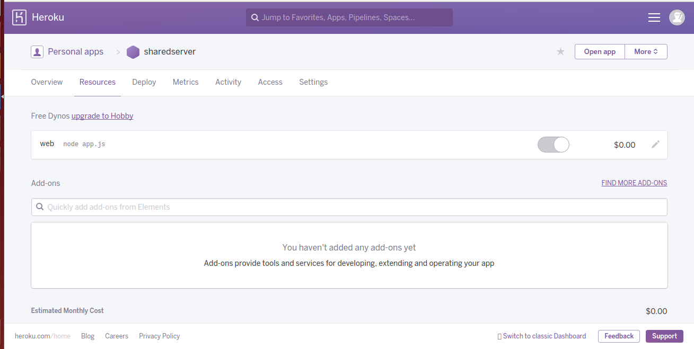

*********
MatchApp

Manual de proyecto
*********
**Grupo 10**

**Ayudante: Christian Calonico**

**Integrantes:**

+-------------------------------------+--------------------------------------+
|       Apellido y Nombre             |              Padrón                  |
+=====================================+======================================+
|       Daye, Gisela Denise           |              87602                   |
+-------------------------------------+--------------------------------------+
|       Federico, Pablo               |              90280                   |
+-------------------------------------+--------------------------------------+
|       Farina, Federico              |              90177                   |
+-------------------------------------+--------------------------------------+
|       Vazquez, Nicolás              |              89172                   |
+-------------------------------------+--------------------------------------+

============================================
Tecnologias utilizadas
============================================

Cliente
----------------------------------------

- Android SDK compatible hasta v23
- Volley
- Material Design para templates

Application Server
----------------------------------------
- Cmake
- Ci-Travis
- Mongoose-cpp
- RocksDB
- Docker
- Code coverage
- Unit tests
- Tests de endpoints con postman y con python

Shared Server
----------------------------------------
- Utilización de Heroku, para hostear nuestra base de datos y la aplicación.

- Utilización de Express + Node.js en sus versiones 4.13 y 0.12.7 respectivamente.

- Utilización de una base de datos PostgreSQL para almacenamiento de la información de Match App.
.. image:: Screenshots/postgresql.png

- Aplicación Web utilizando CSS, HTML, Boostrap, JQuery y Ajax.
- Test  de endpoints con Postman
- Docker

Proyecto
----------------------------------------
- Utilización de la herramienta Trello para seguimiento de tareas, manejo de tickets y demás
.. image:: Screenshots/trello.png
- Documentacion en Sphinx
- Repositorios git. Utilización de 3 repositorios en GitHub, uno para el cliente, otro para el App Server y otro para el Shared Server.
- Shared Server: https://github.com/PabloFederico/SharedServer
- App Server: https://github.com/nicolas-vazquez/tp75521c
- Cliente y Documentación: https://github.com/gisedaye/taller2android
- Dockerhub para imagenes de docker

Hipótesis y Supuestos
----------------------------------------

- El usuario tendrá conocimientos en la utilización de algun sistema Operativo, uso de Internet y contará con un dispositivo mobile con conexión para el correcto funcionamiento del aplicativo.
- La documentación del sistema (manuales de usuario, proyecto, administración y programador) será escrita en Español.
- La interfaz de usuario, tanto en el dispositivo mobile y la Web, será en Español.
- EL usuario final tendrá conocimientos en idioma Español.

Lecciones Aprendidas
----------------------------------------

- Importancia de llevar un backlog de Tareas, a fín de organizar el proyecto y el trabajo en grupo. 
- Estimación de tareas. Control de Tickets.
- Integración en un solo aplicativo de varias tecnologías.
- Importancia de utilizar Docker para el despliegue de la aplicación para proveer una capa de abstracción.
- Utilizar el tiempo para pensar una buena solución, arquitectura, desglose de tareas, etc. al comienzo del proyecto es de vital importancia para lograr el éxito del mismo y limitar los cambios en el mismo. 

