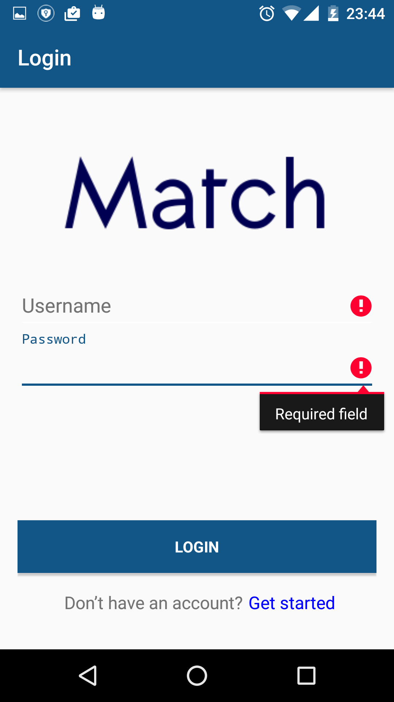
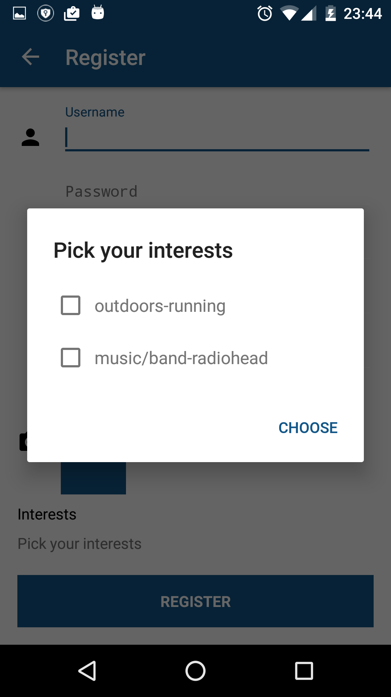
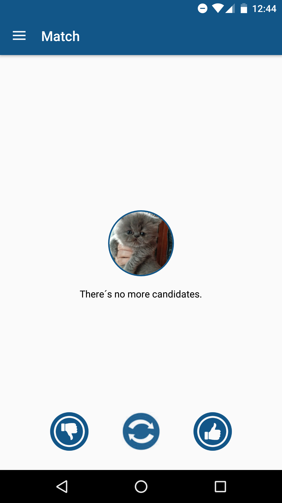
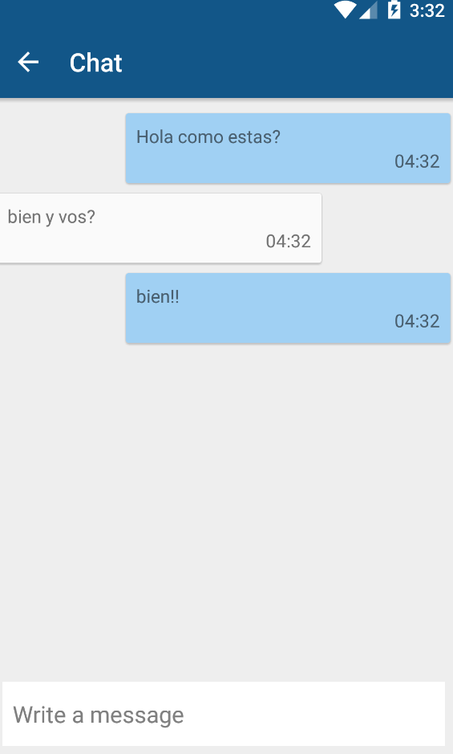
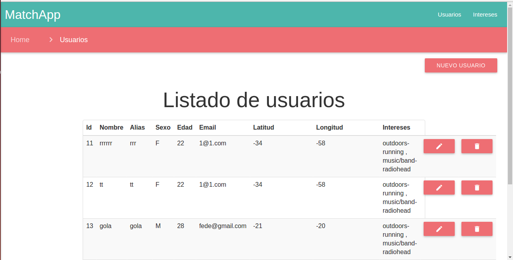

*********
MatchApp

Manual de Usuario
*********
**Grupo 10**

**Taller de Programación II**

**Ayudante: Christian Calonico**

**Integrantes:**

+-------------------------------------+--------------------------------------+
|       Apellido y Nombre             |              Padrón                  |
+=====================================+======================================+
|       Daye, Gisela Denise           |              87602                   |
+-------------------------------------+--------------------------------------+
|       Federico, Pablo               |              90280                   |
+-------------------------------------+--------------------------------------+
|       Farina, Federico              |              90177                   |
+-------------------------------------+--------------------------------------+
|       Vazquez, Nicolás              |              89172                   |
+-------------------------------------+--------------------------------------+

============================================
Cliente
============================================

- Instalar apk en el teléfono celular
https://drive.google.com/open?id=0B96FtE1h2ukFQ1hWS0xGY251QWs

- Ejecutar el Application Server en su PC seteando ip del host

- Abrir aplicación en el celular

- Se encontrará con la pantalla de login

.. image:: Screenshots/login.png
	:width: 400

- Si ya posee un usuario registrado, ingrese los campos requeridos de usuario y clave y luego haga tap en el botón de entrar. Si los datos son correctos se lo redireccionará a la pantalla de búsqueda de matches
- Si los datos son incorrectos aparecerá un mensaje de error y deberá volver a intentar loguearse.

- Si no posee un usuario deberá crear uno haciendo tap en el texto “Get started” de la pantalla de login. Se lo redireccionará a la pantalla de registro.

.. image:: Screenshots/registro.png
	:width: 400

- Complete los datos requeridos para crear el usuario. Para elegir los intereses haga click en pick interests.

- Haga tap en Register para crear el nuevo usuario. 

- Si los datos son correctos se lo redireccionará a la pantalla de login para que pueda ingresar a la aplicación.
- Si los datos son erróneos aparecerá un mensaje de error y deberá reintentar el registro.

.. image:: Screenshots/registro_failed.png
	:width: 400

- Al loguearse se lo redireccionará a la pantalla de búsqueda de matches

- Podrá navegar entre los candidatos haciendo swipe en la pantalla hacia la derecha o izquierda.
- Podrá darle un like o un dislike al candidato haciendo click en los botones correspondientes.

- Si hay match entre los usuarios se abrirá la pantalla de chat y podrán enviarse mensajes.

- Podrá ver su lista de ingresando desde el menú lateral, los vera en forma de lista una vez que tenga el match.

.. image:: Screenshots/sidebar.png
	:width: 400

.. image:: Screenshots/matches.png
	:width: 400

============================================
Shared Server
============================================

- Para comenzar a utilizar el Shared Server, debe redirigirse con su navegador al sitio https://tallerdeprogramacionii-1c2016.herokuapp.com/. Una vez allí, observará la portada inicial del sitio como la que se muestra a continuación:
.. image:: Screenshots/shared_portada.png

- Para dar de alta un usuario haga click en “Alta usuario”. Se lo redireccionará a la pantalla de registro de usuario
.. image:: Screenshots/shared_altaUsuario.png

- Al ingresar, se le mostrará una advertencia para poder activar la Geolocalización a fin de saber su ubicación geográfica
.. image:: Screenshots/shared_localizacion.png

- Al aceptar, se mostrará en la parte inferior del formulario su localización actual
.. image:: Screenshots/shared_localizacion2.png

- Podrá seleccionar una imagen de perfil haciendo click en "Pick Photo" y seleccionando una imagen de su PC
.. image:: Screenshots/profilephoto.png

- Ingrese los datos requeridos y haga click en el botón “Enviar” para agregar un usuario a Match App.

- Para ver los usuarios registrados seleccione la opción "Usuarios" desde la portada del sitio. Se redireccionará a la pantalla de listado de usuarios

- Cada usuario se puede borrar, eliminándolo completamente de la aplicación. Para ello sólo debe hacer click en el icono de borrado que se encuentra en el extremo derecho de la fila de cada usuario. Además, se podrán editar las propiedades de cada usuario, haciendo click en el icono en forma de lapiz que se encuentra próximo al icono de borrado. Si se selecciona la edición de un usuario, la aplicación lo redireccionará a una nueva pantalla, como la que se muestra a continuación

.. image:: Screenshots/shared_editUsuarios.png

- La pantalla le mostrará los datos ingresados por el usuario en el registro o editados anteriormente. Una vez finalizada la edición, debe hacer click en "Enviar" para guardar los cambios

- Además, se podrán agregar y borrar los intereses globales de la aplicación. Para ingresar, dirigirse a la portada y seleccionar "Intereses" en el margen superior derecho. Esto lo llevará a la pantalla con el listado de intereses actuales
.. image:: Screenshots/shared_listadoIntereses.png

- Para dar de alta un nuevo interés, debe hacer click en el botón "Alta interes". 
.. image:: Screenshots/shared_altaInteres.png 

- Luego de completar los campos, hacer click en Enviar para dar de alta el nuevo interés.
- Se podrá borrar un interés haciendo click en el botón que se encuentra en el extremo derecho de la fila correspondiente a cada interés.
