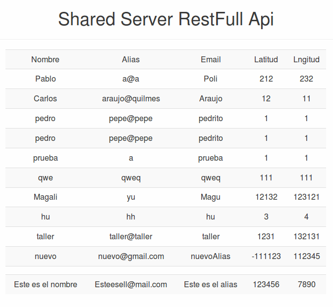

*********
MatchApp

Manual de usuario
*********
**Grupo 10**

**Ayudante asignado: Christian Calonico**

**Integrantes:**

+-------------------------------------+--------------------------------------+
|       Apellido y Nombre             |              Padrón                  |
+=====================================+======================================+
|       Daye, Gisela Denise           |              87602                   |
+-------------------------------------+--------------------------------------+
|       Federico, Pablo               |              90280                   |
+-------------------------------------+--------------------------------------+
|       Farina, Federico              |              90177                   |
+-------------------------------------+--------------------------------------+
|       Vazquez, Nicolás              |              89172                   |
+-------------------------------------+--------------------------------------+

============================================
Cliente
============================================

- Instalar apk en el telefono celular
https://drive.google.com/open?id=0B96FtE1h2ukFNHdob042a3ZQU1k

- Ejecutar el Application server en su pc

- Abrir aplicacion en el celular

- Se encontrara con la pantalla de login

.. image:: Screenshots/login.png

- Si ya posee un usuario registrado, ingrese los campos requeridos de usuario y clave y luego haga tap en el boton de entrar. Si los datos son los correctos se lo redireccionara a la pantalla de busqueda de matchs
- Si los datos son incorrectos aparecera un mensaje de error y debera volver a intentar loguearse.

- Si no posee un usuario debera crear uno haciendo tap en el texto “Registrate en Match” de la pantalla de login. Se lo redireccionara a la pantalla de registro.
.. image:: Screenshots/registro.png

- Llene los datos requeridos para crear el usuario y haga tap en registrarse para crear el nuevo usuario. Si los datos son correctos se lo redireccionara a la pantalla de login para que pueda ingresar a la aplicacion.
- Si los datos son erroneos aparecera un mensaje de error y debera reintentar el registro.

- Al loguearse se lo redireccionara a la pantalla de busqueda de matches
.. image:: Screenshots/match.png

- Podra navegar entre los candidatos haciendo swipe en la pantalla, podra moverse a la derecha o a la izquierda.
- Podra darle un like o un dislike al candidato haciendo click en los botones flotantes.

- Si hay match de ambos lados se abrira la pantalla de chat y podran mandarse mensajes entre ambos usuarios.
.. image:: Screenshots/chat.png

- Podra ver sus matches disponibles desde la pantalla de matches disponibles, ingresando desde el menu lateral.
.. image:: Screenshots/matches-disponibles.png

- Podra cambiar sus intereses desde su perfil, ingresando desde el menu lateral.
.. image:: Screenshots/interests.png

============================================
Shared Server
============================================

- Ingrese a https://sharedserver.herokuapp.com/

- Para dar de alta un usuario haga click en “Alta usuario”. Se lo redireccionara a la pantalla de alta de usuario
.. image:: Screenshots/user.png

- Ingrese lo datos requeridos y haga click en el boton “Alta Usuario”
- Se le podran agregar intereses al usuario en la vista de alta

- Si el usuario se creo correctamente se mostrara el texto “Created”

- Para ver los usuarios registrados ingrese haga click en “Ver usuarios”. Se redireccionara a la pantalla de listado de usuarios

- Para borrar un usuario haga click en el boton Delete.
- Para editar los datos de un usuario haga click en el boton Edit. Se lo redireccionara a la pantalla de Modificar usuario.
- Se le podran modificar los intereses al usuario en la vista de edicion

- Se podra ver el listado de intereses haciendo click en "Ver intereses"
- Se podran dar de alta intereses en distintas categorias haciendo click en el boton de "Alta interes".
- Se podra modificar un interes haciendo click en el boton de "Editar" del listado de intereses.
- Se podra borrar un interes haciendo click en el boton de "Delete" del listado de intereses.
